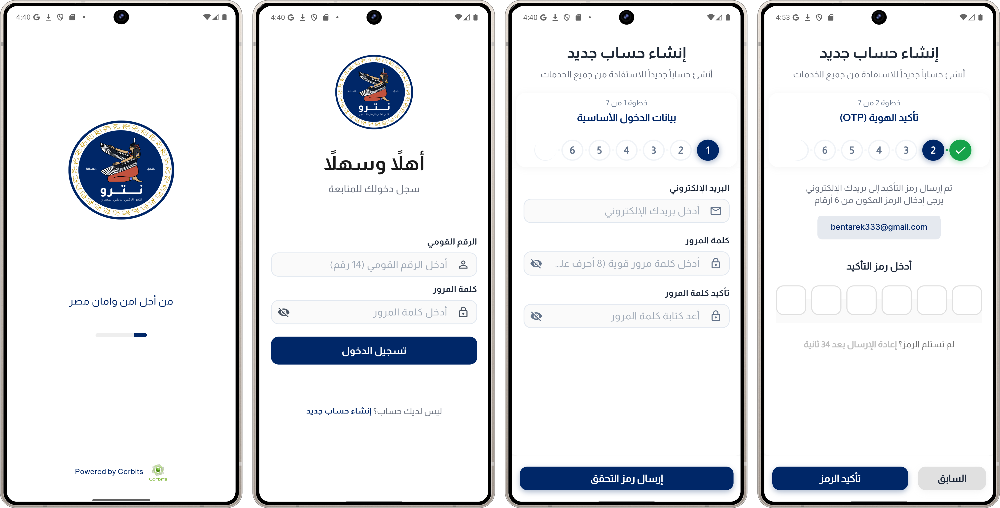
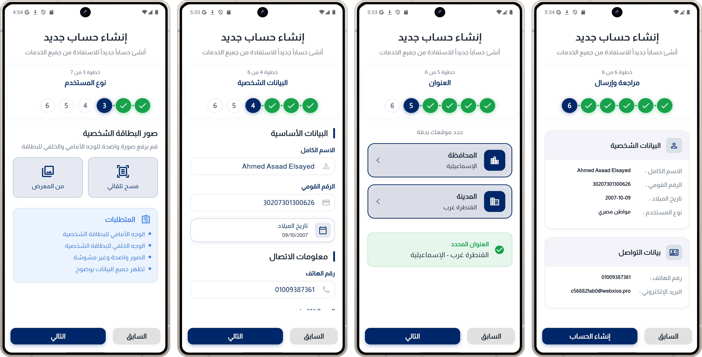
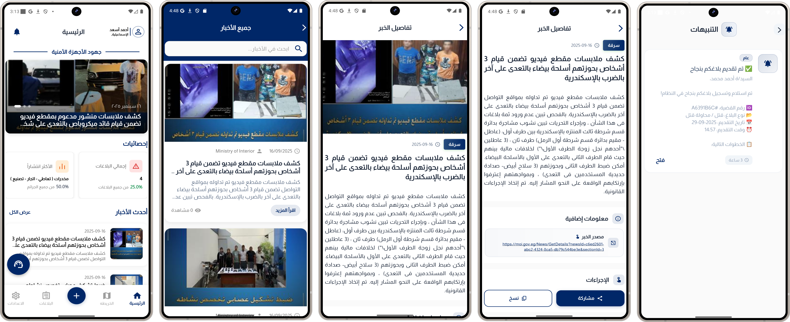
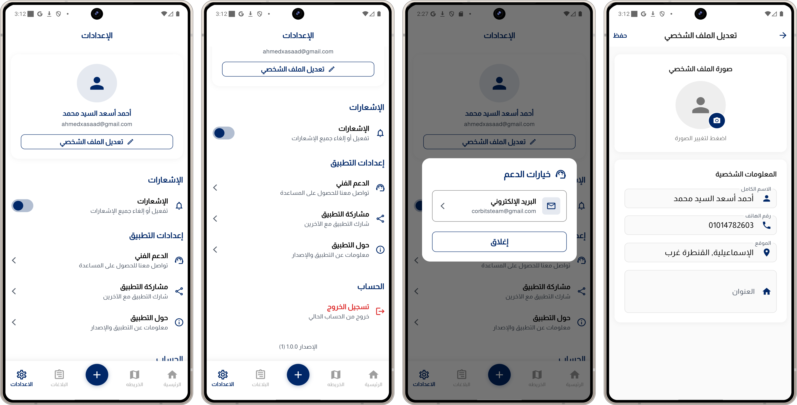
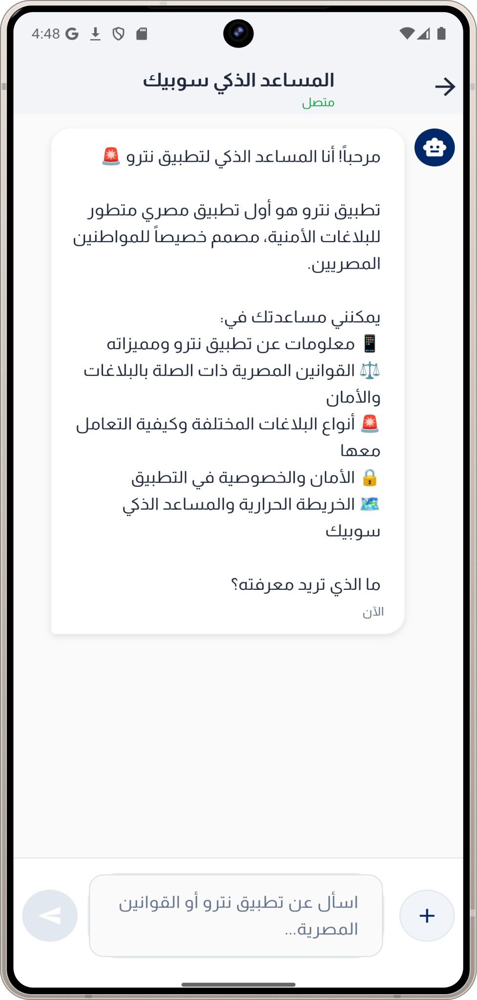
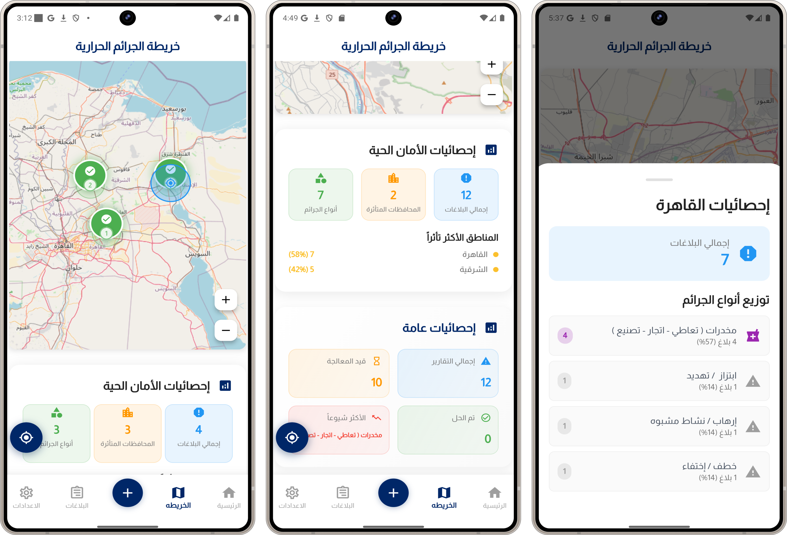
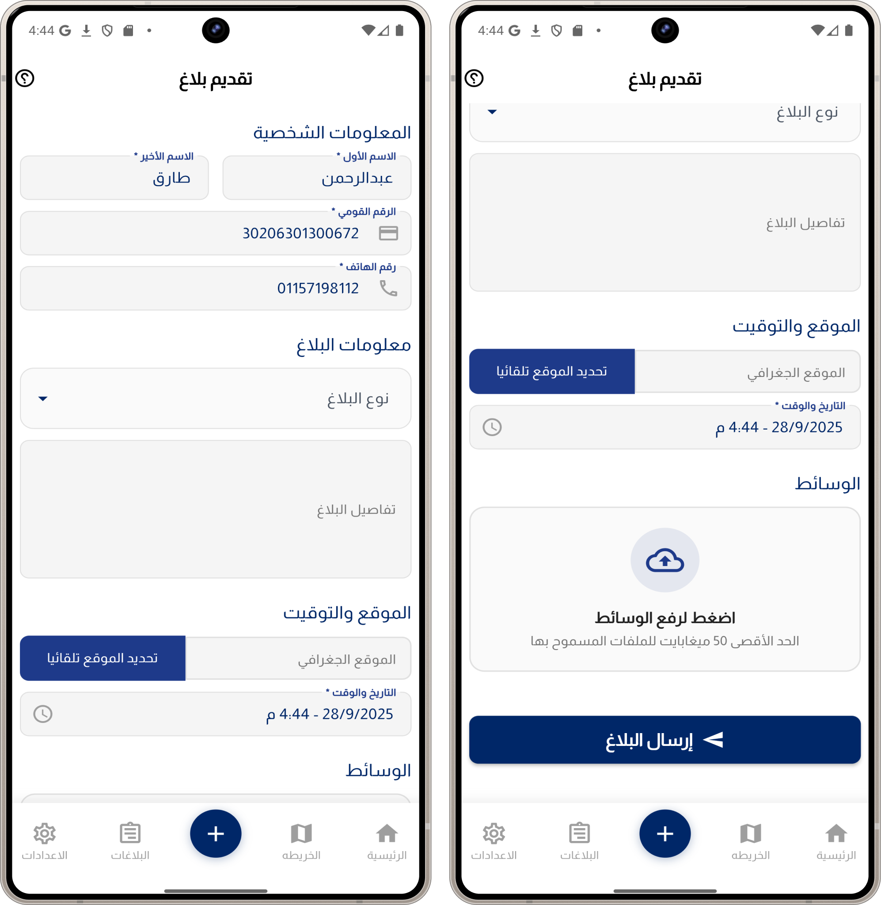
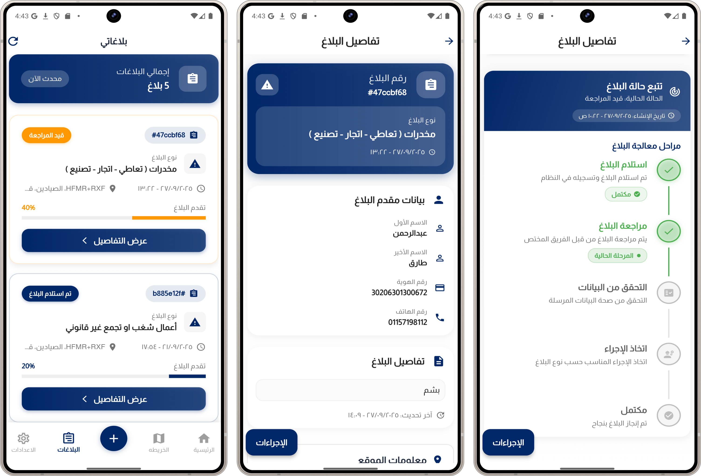

<div align="center">
  

# Netru

### Smart Security and Services App for Egyptian Citizens

A comprehensive application providing security and protection services with an AI legal assistant, interactive crime maps, and electronic reporting system for Egyptian citizens aged 18 and above.


</div>

---

## 📋 Table of Contents

- [About](#about)
- [Features](#features)
- [Screenshots](#screenshots)
- [Technologies](#technologies)
- [Project Structure](#project-structure)
- [Getting Started](#getting-started)
- [Installation](#installation)
- [Usage](#usage)
- [Contributing](#contributing)
- [License](#license)

---

## 🎯 About

**Netru** is an advanced Flutter application designed specifically for Egyptian citizens, aiming to provide a comprehensive platform for security and smart services. The app includes various advanced features such as an AI legal assistant, interactive crime maps, and an electronic reporting system.

### 🇪🇬 For Egyptian Citizens

The app is optimized specifically for the Egyptian environment and targets adult citizens (18+ years) with full support for Arabic language and Egyptian laws.

---

## ✨ Features

### 🤖 AI Legal Assistant

- **Sobek**: AI assistant specialized in Egyptian laws
- Support for multiple conversations with session history
- Instant answers to legal inquiries
- Easy and advanced conversation interface

### 🗺️ Interactive Crime Maps

- **Advanced Heat Map** for real-time crime data display
- Identification of safe and dangerous areas
- Detailed statistics by area and type
- Integration with GPS location services

### 📝 Electronic Reporting System

- Easy creation of electronic reports
- Support for document and image uploads
- Real-time report status tracking
- Professional PDF generation

### 🔐 Advanced Authentication System

- Secure login with Supabase
- Automatic Egyptian ID data extraction
- Personal data protection

### 📱 Advanced User Interface

- Dark and light mode support
- Responsive interface with Screen Util
- Elegant Arabic fonts (Almarai, Tajawal)
- Smooth animations with Flutter Animate

### 🔔 Smart Notification System

- Firebase Cloud Messaging notifications
- Custom local notifications
- Real-time security alerts

### 👨‍💼 Administrative Dashboard

- User and report management
- Comprehensive statistics
- Manager notification system

### 📊 Additional Features

- **Case Management**: Legal case tracking
- **News & Updates**: Latest security news
- **Interactive Maps**: Flutter Map with location services
- **Image Compression**: App performance optimization
- **Document Scanning**: Data extraction from documents

---

## 📱 Screenshots

### 🔐 Authentication Screens

<div align="center">
  
  
</div>

### 🏠 Home & Main Features

<div align="center">
  
  
</div>

### 🤖 AI Chatbot & Legal Assistant

<div align="center">
  
</div>

### 🗺️ Crime Heat Map

<div align="center">
  
</div>

### 📝 Reports System

<div align="center">
  
  
</div>

---

## 🛠️ Technologies

### Core

- **Flutter** 3.7.2
- **Dart** SDK
- **Clean Architecture** Pattern

### State Management

- **Flutter Bloc** 8.1.4 (BLoC Pattern)
- **Equatable** 2.0.7 (Value Equality)

### Backend & Database

- **Supabase Flutter** 2.8.1 (Backend as a Service)
- **Firebase Core** 3.13.0
- **Firebase Messaging** 15.2.5 (Push Notifications)

### Key Packages

| Package                         | Version | Purpose                           |
| ------------------------------- | ------- | --------------------------------- |
| **flutter_bloc**                | ^8.1.4  | State Management (BLoC Pattern)   |
| **supabase_flutter**            | ^2.8.1  | Backend Database & Authentication |
| **dio**                         | ^5.9.0  | HTTP Client for API Calls         |
| **cached_network_image**        | ^3.4.1  | Image Caching & Loading           |
| **flutter_screenutil**          | ^5.9.3  | Responsive UI Design              |
| **google_fonts**                | ^6.3.0  | Typography & Font Loading         |
| **google_sign_in**              | ^6.2.1  | Google Authentication             |
| **flutter_map**                 | ^8.2.1  | Interactive Maps                  |
| **geolocator**                  | ^14.0.2 | GPS Location Services             |
| **geocoding**                   | ^3.0.0  | Address ↔️ Coordinates             |
| **image_picker**                | ^1.2.0  | Camera & Gallery Access           |
| **cunning_document_scanner**    | ^1.3.1  | Document Scanning                 |
| **flutter_local_notifications** | ^19.1.0 | Local Push Notifications          |
| **shared_preferences**          | ^2.5.3  | Local Data Persistence            |
| **lottie**                      | ^3.3.1  | Vector Animations                 |
| **flutter_animate**             | ^4.5.2  | UI Animations                     |
| **pin_code_fields**             | ^8.0.1  | OTP Input Fields                  |
| **country_picker**              | ^2.0.24 | Country Code Selection            |
| **pdf**                         | ^3.10.1 | PDF Generation                    |
| **fl_chart**                    | ^0.64.0 | Charts & Data Visualization       |
| **get_it**                      | ^8.2.0  | Dependency Injection              |
| **dartz**                       | ^0.10.1 | Functional Programming            |
| **logger**                      | ^2.4.0  | Advanced Logging                  |

### Development Tools

- **flutter_lints** ^3.0.0 (Code Analysis)
- **build_runner** ^2.4.10 (Code Generation)
- **bloc_test** ^9.1.5 (BLoC Testing)

---

## 📁 Project Structure

```
lib/
├── 📁 core/                    # Core functionality
│   ├── 📁 constants/          # App constants
│   ├── 📁 cubit/             # Global state management
│   │   ├── locale/           # Localization cubit
│   │   └── theme/            # Theme cubit
│   ├── 📁 di/                # Dependency injection
│   ├── 📁 domain/            # Core domain entities
│   ├── 📁 errors/            # Error handling
│   ├── 📁 extensions/        # Dart extensions
│   ├── 📁 helper/            # Helper utilities
│   ├── 📁 network/           # Network handling
│   ├── 📁 routing/           # App routing
│   ├── 📁 services/          # Core services
│   ├── 📁 theme/             # App theming
│   ├── 📁 utils/             # Utilities & helpers
│   └── 📁 widgets/           # Reusable widgets
├── 📁 features/               # Feature modules
│   ├── 📁 admin/             # Admin dashboard
│   ├── 📁 auth/              # Authentication
│   ├── 📁 cases/             # Legal cases
│   ├── 📁 chatbot/           # AI Legal Assistant
│   ├── 📁 heatmap/           # Crime heat maps
│   ├── 📁 home/              # Home screen
│   ├── 📁 news/              # News & updates
│   ├── 📁 notifications/     # Notifications
│   ├── 📁 onboarding/        # App introduction
│   ├── 📁 profile/           # User profile
│   ├── 📁 reports/           # Electronic reporting
│   ├── 📁 settings/          # App settings
│   └── 📁 splash/            # Splash screen
├── 📁 shared/                 # Shared components
├── app.dart                   # App configuration
├── app_bloc_observer.dart     # BLoC observer
├── firebase_options.dart      # Firebase config
└── main.dart                 # App entry point
```

### 🏗️ Architecture Pattern

The project uses **Clean Architecture** with **BLoC Pattern** for:

- Clear separation between layers
- Easy testing and maintenance
- Reusability
- Advanced state management

---

## 🚀 Getting Started

### Prerequisites

- **Flutter SDK** (3.7.2 or newer)
- **Dart SDK**
- **Android Studio** / **Xcode**
- **Git**
- **Firebase** account (for notifications)
- **Supabase** account (for database)

### 🔧 Firebase Setup

1. Create a new Firebase project
2. Enable Firebase Authentication
3. Enable Firebase Cloud Messaging
4. Download configuration files:
   - `android/app/google-services.json`
   - `ios/Runner/GoogleService-Info.plist`

### 🔧 Supabase Setup

1. Create a new Supabase project
2. Get Project URL and Anon Key
3. Set up required database and tables

---

## 💻 Installation

### 1. Clone the repository

```bash
git clone https://github.com/CorbitsTeam/netru_app.git
cd netru_app
```

### 2. Install dependencies

```bash
flutter pub get
```

### 3. Set up configuration files

```bash
# Firebase configuration
flutter packages pub run build_runner build

# Generate app icon
flutter packages pub run flutter_launcher_icons:main
```

### 4. Run the app

```bash
# For Android
flutter run

# For iOS
flutter run
```

---

## 🎮 Usage

### 🔐 Getting Started

1. **Registration**: Create a new account or login
2. **Data Setup**: Add Egyptian ID data
3. **Explore**: Browse different features

### 🤖 Using the AI Assistant

- Navigate to "AI Assistant" page
- Start a new conversation
- Ask about Egyptian laws or general inquiries

### 🗺️ Using the Crime Map

- Allow location access
- View statistics by area
- Browse interactive data

### 📝 Creating a Report

- Navigate to "Create Report" page
- Fill in required data
- Upload documents (optional)
- Submit report

---

## 🤝 Contributing

We welcome contributions from developers! To contribute:

### 1. Fork the project

```bash
git fork https://github.com/CorbitsTeam/netru_app.git
```

### 2. Create a new branch

```bash
git checkout -b feature/new-feature
```

### 3. Commit changes

```bash
git commit -m "Add some feature"
```

### 4. Push to branch

```bash
git push origin feature/new-feature
```

### 5. Create Pull Request

### 📋 Guidelines

- Follow Clean Architecture
- Write tests for new components
- Use comments in Arabic/English
- Follow Flutter/Dart style guide

---

## 📄 License

This project is licensed under the MIT License - see the [LICENSE](LICENSE) file for details.

```
MIT License

Copyright (c) 2024 Netru App

Permission is hereby granted, free of charge, to any person obtaining a copy
of this software and associated documentation files (the "Software"), to deal
in the Software without restriction, including without limitation the rights
to use, copy, modify, merge, publish, distribute, sublicense, and/or sell
copies of the Software, and to permit persons to whom the Software is
furnished to do so, subject to the following conditions:

The above copyright notice and this permission notice shall be included in all
copies or substantial portions of the Software.

THE SOFTWARE IS PROVIDED "AS IS", WITHOUT WARRANTY OF ANY KIND, EXPRESS OR
IMPLIED, INCLUDING BUT NOT LIMITED TO THE WARRANTIES OF MERCHANTABILITY,
FITNESS FOR A PARTICULAR PURPOSE AND NONINFRINGEMENT. IN NO EVENT SHALL THE
AUTHORS OR COPYRIGHT HOLDERS BE LIABLE FOR ANY CLAIM, DAMAGES OR OTHER
LIABILITY, WHETHER IN AN ACTION OF CONTRACT, TORT OR OTHERWISE, ARISING FROM,
OUT OF OR IN CONNECTION WITH THE SOFTWARE OR THE USE OR OTHER DEALINGS IN THE
SOFTWARE.
```

---

## 📞 Contact & Support

- **Email**: corbitsteam@gmail.com
- **Documentation**: [Full Documentation](https://netru-eg.blogspot.com/)

---


<div align="center">
  <p>Made with ❤️ in Egypt for Egyptian Citizens</p>

**Netru | Your Safety is Our Priority**

</div>
