# نترو - تطبيق الأمن والحماية المجتمعي

<div align="center">
  
  
  **من أجل أمن وأمان مصر**
  
  [](https://flutter.dev/)
  [](https://flutter.dev/)
  [](#)
</div>

## نظرة عامة

تطبيق **نترو** هو تطبيق أمني متطور يهدف إلى تعزيز الأمن المجتمعي من خلال ربط المواطنين بوزارة الداخلية المصرية. يوفر التطبيق منصة سهلة وآمنة للإبلاغ عن الحوادث الأمنية، متابعة القضايا الأمنية، وتلقي التنبيهات المهمة.

## الميزات الرئيسية

### 🚨 نظام الإبلاغات المتقدم

- إرسال بلاغات فورية للجهات الأمنية
- تتبع حالة البلاغات المرسلة
- نظام تصنيف متنوع للحوادث

### 🗺️ خريطة الجرائم التفاعلية

- عرض الأنشطة الإجرامية على الخريطة
- مناطق الخطر والتحذيرات الأمنية
- إحصائيات مفصلة حسب المنطقة

### 📊 إحصائيات وتحليلات

- إحصائيات الجرائم والحوادث
- معدلات الأمان في المناطق المختلفة
- تقارير دورية عن الوضع الأمني

### 🔔 نظام التنبيهات الذكي

- تنبيهات فورية للحوادث القريبة
- إشعارات حالة البلاغات
- تحذيرات أمنية مهمة

### 👤 إدارة الحساب الشخصي

- ملف شخصي آمن
- سجل البلاغات السابقة
- إعدادات الخصوصية والأمان

## لقطات الشاشة

### الشاشة الرئيسية

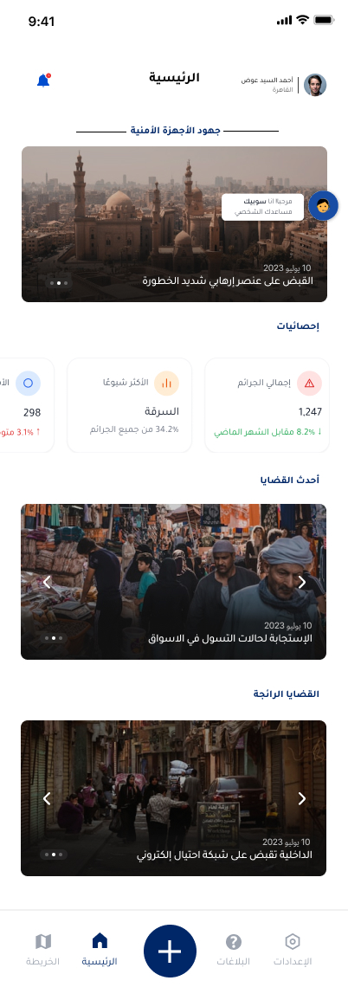

تعرض الشاشة الرئيسية أهم الأخبار الأمنية وإحصائيات سريعة حول الوضع الأمني.

### نظام التنبيهات

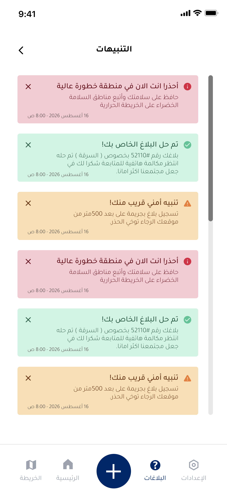

نظام تنبيهات شامل يشمل:

- تنبيهات المناطق عالية الخطورة
- حل البلاغات المرسلة
- تنبيهات أمنية قريبة من الموقع

### جهود الأجهزة الأمنية

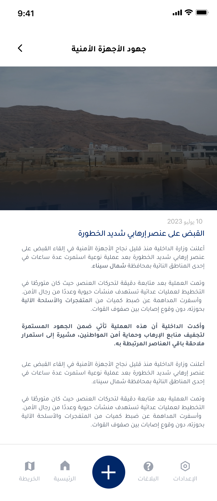

متابعة عمليات الأجهزة الأمنية ونتائجها في محافظة شمال سيناء.

### خريطة الجرائم

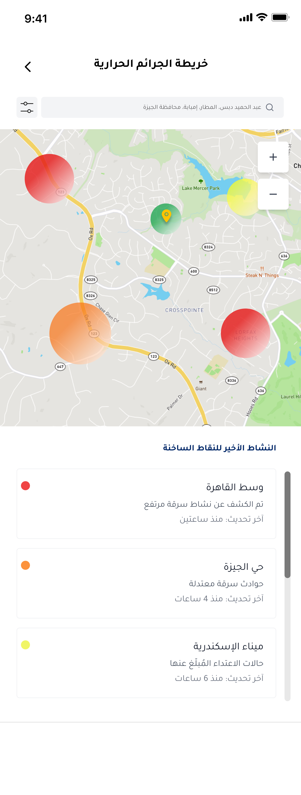

خريطة تفاعلية تعرض:

- النشاط الأخير للنقاط الساخنة
- مناطق الجرائم المختلفة بألوان متدرجة
- إحصائيات الحوادث حسب الموقع

### مساعد الذكي الاصطناعي

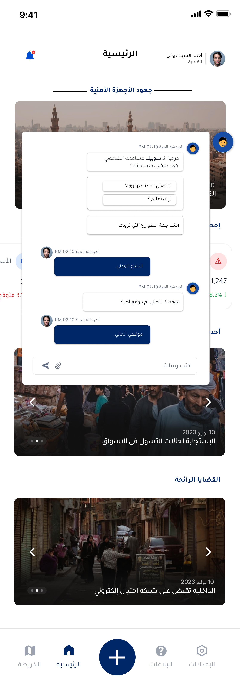


### شاشة تسجيل الدخول

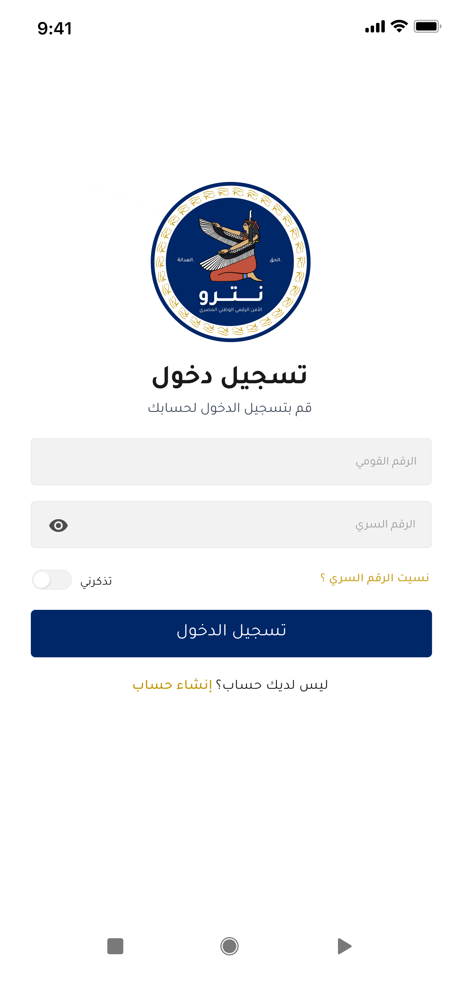

نظام تسجيل دخول آمن يتضمن:

- الرقم القومي
- الرقم السري مع خيار إظهار/إخفاء
- خيار "تذكرني"

### إعدادات الحساب

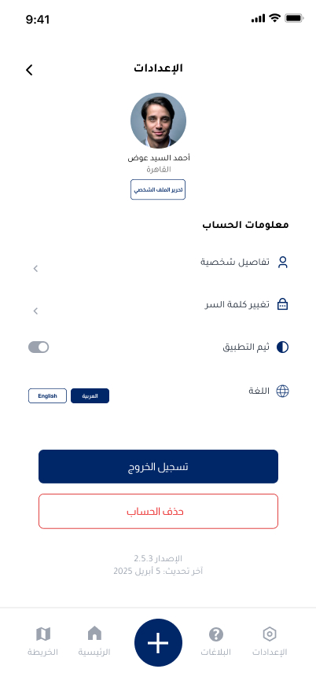

لوحة إعدادات شاملة تتضمن:

- معلومات الحساب الشخصي
- تفاصيل شخصية
- تغيير كلمة المرور
- تفعيل/إلغاء التحقق
- خيارات اللغة (العربية/English)

### تفاصيل البلاغ

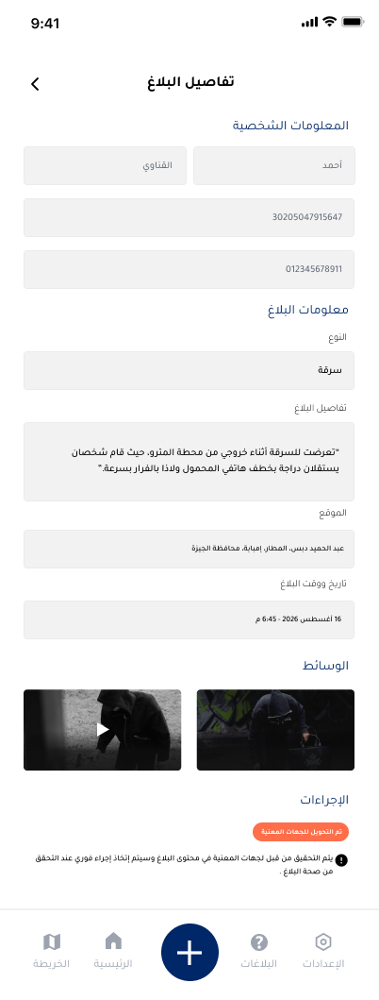

صفحة مفصلة لتقديم البلاغات تشمل:

- معلومات المبلغ الشخصية
- معلومات البلاغ التفصيلية
- إرفاق الوسائط (صور/فيديو)
- الإجراءات المتاحة

### تقديم بلاغ

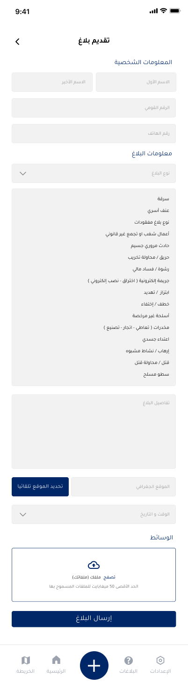

نموذج شامل لتقديم البلاغات يتضمن:

- معلومات شخصية
- نوع البلاغ (قائمة منسدلة متنوعة)
- تفاصيل البلاغ
- الموقع الجغرافي
- إرفاق الملفات

### حالة البلاغات

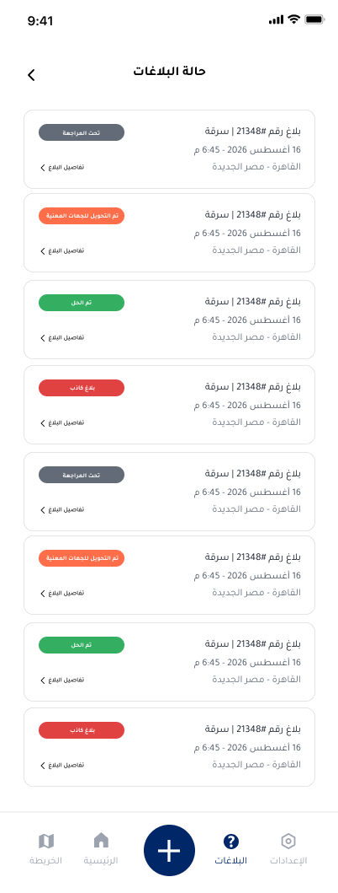

متابعة شاملة لجميع البلاغات المرسلة مع حالات مختلفة:

- قيد المراجعة (رمادي)
- قيد التحقيق للوحدات المعنية (برتقالي)
- تم الحل (أخضر)
- مغلق نهائياً (أحمر)

### إنشاء حساب جديد

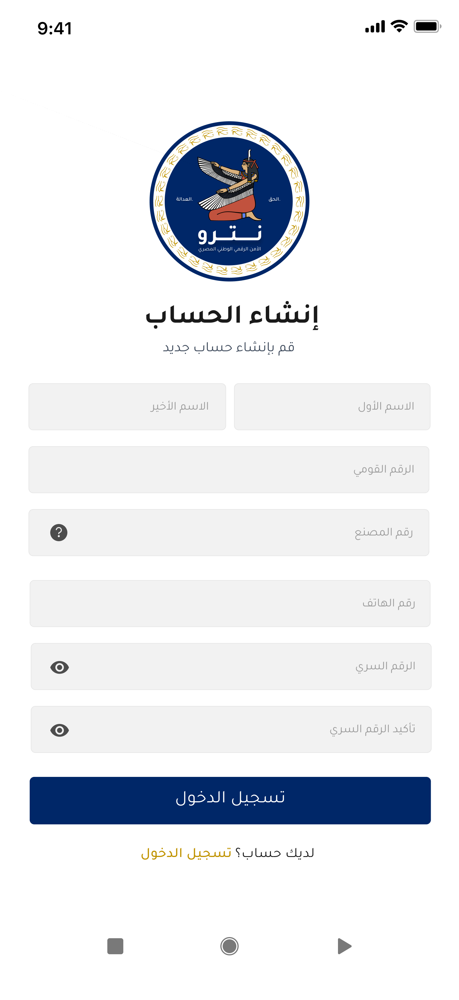

صفحة تسجيل مستخدم جديد تتطلب:

- الاسم الأول والأخير
- الرقم القومي
- رقم المصنع
- رقم الهاتف
- الرقم السري وتأكيده

### شاشة البداية

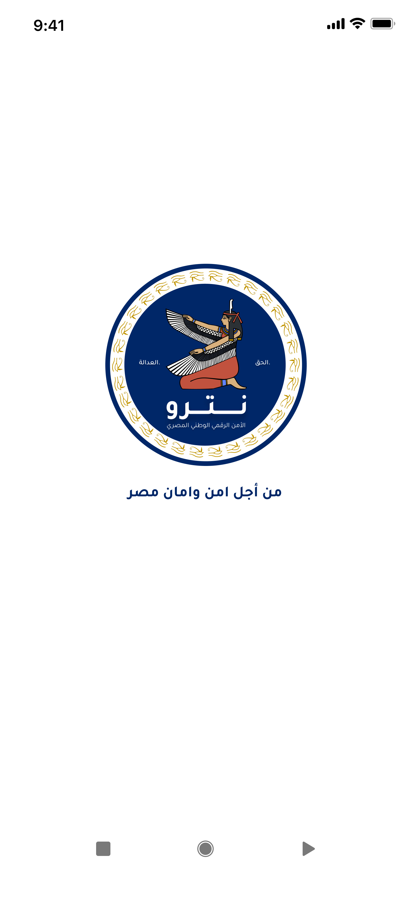

شاشة ترحيب تعرض شعار "نترو" مع الشعار الوطني "من أجل أمن وأمان مصر".

## المتطلبات التقنية

### Flutter SDK

```
Flutter 3.35.1
```

### المنصات المدعومة

- 📱 iOS 11.0+
- 🤖 Android API 21+

### الأذونات المطلوبة

#### Android

```xml
<uses-permission android:name="android.permission.INTERNET" />
<uses-permission android:name="android.permission.ACCESS_FINE_LOCATION" />
<uses-permission android:name="android.permission.ACCESS_COARSE_LOCATION" />
<uses-permission android:name="android.permission.CAMERA" />
<uses-permission android:name="android.permission.WRITE_EXTERNAL_STORAGE" />
```

#### iOS

```xml
<key>NSLocationWhenInUseUsageDescription</key>
<string>يحتاج التطبيق للوصول لموقعك لتحديد موقع البلاغ</string>
<key>NSCameraUsageDescription</key>
<string>يحتاج التطبيق للكاميرا لتصوير الحوادث</string>
```

## التثبيت والتشغيل

### المتطلبات الأساسية

تأكد من تثبيت:

- [Flutter SDK](https://flutter.dev/docs/get-started/install)
- [Android Studio](https://developer.android.com/studio) أو [VS Code](https://code.visualstudio.com/)
- [Xcode](https://developer.apple.com/xcode/) (للتطوير على iOS)

### خطوات التشغيل

1. **استنساخ المشروع**

```bash
git clone [repository-url]
cd netro_app
```

2. **تثبيت التبعيات**

```bash
flutter pub get
```

3. **تشغيل أكواد البناء**

```bash
flutter packages pub run build_runner build
```

4. **تشغيل التطبيق**

```bash
flutter run
```

### بناء التطبيق للإنتاج

#### Android (APK)

```bash
flutter build apk --release
```

#### Android (App Bundle)

```bash
flutter build appbundle --release
```

#### iOS

```bash
flutter build ios --release
```

## التبعيات الرئيسية

| Package                | الإصدار | الوصف                       |
| ---------------------- | ------- | --------------------------- |
| `flutter_bloc`         | latest  | إدارة الحالة                |
| `dio`                  | ^5.9.0  | HTTP Client                 |
| `geolocator`           | ^14.0.2 | خدمات الموقع                |
| `flutter_map`          | ^8.2.1  | عرض الخرائط                 |
| `cached_network_image` | ^3.4.1  | تحميل وحفظ الصور            |
| `shared_preferences`   | ^2.5.3  | التخزين المحلي              |
| `permission_handler`   | ^12.0.1 | إدارة الأذونات              |
| `easy_localization`    | ^3.0.8  | الترجمة والدعم متعدد اللغات |
| `flutter_screenutil`   | ^5.9.3  | التصميم المتجاوب            |
| `google_fonts`         | ^6.3.0  | الخطوط المخصصة              |
| `lottie`               | ^3.3.1  | الرسوم المتحركة             |
| `animate_do`           | ^4.2.0  | تأثيرات الحركة              |

## الأمان والخصوصية

- 🔐 تشفير شامل لجميع البيانات المرسلة
- 🛡️ التحقق الثنائي من الهوية
- 📱 حماية البيانات الشخصية وفقاً لقوانين حماية البيانات
- 🔒 تخزين آمن للمعلومات الحساسة

## الدعم والمساعدة

للحصول على المساعدة أو الإبلاغ عن المشاكل:

- 📧 البريد الإلكتروني: support@netro-app.gov.eg
- 📞 الخط الساخن: 19696
- 🌐 الموقع الرسمي: [www.netro-app.gov.eg]

## ملاحظات مهمة

- هذا التطبيق مخصص للاستخدام داخل جمهورية مصر العربية فقط
- يجب التحقق من صحة البيانات المدخلة قبل الإرسال
- في حالة الطوارئ، يُنصح بالاتصال المباشر بالأرقام المخصصة للطوارئ

---

<div align="center">
  
**تم التطوير بواسطة فريق كوربتس**

_من أجل أمن وأمان مصر_ 🇪🇬

</div>
